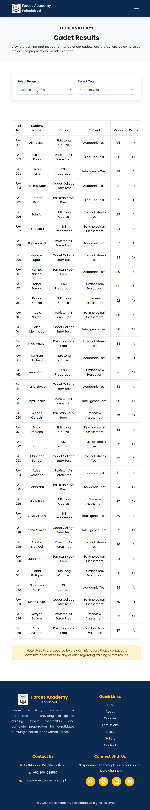

# Forces Academy Faisalabad Website

A responsive frontend website developed as part of the Code Saviours (SMC-PRIVATE) Limited Frontend Internship Programme (SI-26). The project represents a modern military academy website featuring information about admissions, courses, results, gallery, and contact details with a responsive and interactive user interface.


## Live Site

https://jannatimran1213.github.io/forces-academy-frontend-codesaviours-si26-Jannat/

##Github Repository

https://github.com/jannatimran1213/forces-academy-frontend-codesaviours-si26-Jannat

##  Screenshots
(Tablet View)
### Home Page


### About Page


### Result Page


### Gallery Page


## Project Structure

```text
forces-academy-frontend-codesaviours-si26-Jannat/
│
├── index.html
├── about.html
├── courses.html
├── admissions.html
├── results.html
├── gallery.html
├── contact.html
│
├── css/
│   └── style.css
│
├── js/
│   └── main.js
│
├── images/
│   ├── home.png
│   ├── about.png
│   ├── result.png
│   └── ...
│
└── README.md

##  Tech Stack

- HTML5
- CSS3
- Bootstrap 5
- JavaScript
- Bootstrap Icons
- GLightbox
- AOS (Animate On Scroll)

##  Features
- Responsive design
- Sticky navigation bar
- Hero section
- About preview
- Featured courses
- Admissions information
- Results page
- Interactive gallery with category filtering
- Image lightbox
- Animated statistics counter
- Testimonials carousel
- Contact form validation
- Smooth scrolling
- Back-to-top button

## How to Run Locally

1. Clone or download the repository.
2. Open the project folder.
3. Open `index.html` in a web browser.
4. No server or database setup is required.

Built by: Jannat Imran | Code Saviours SI-26 | 2026
